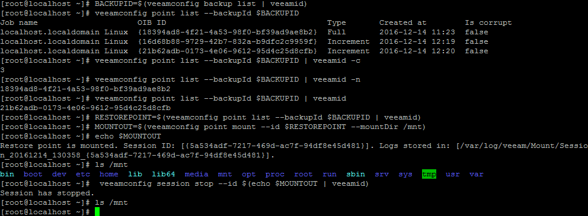

# VeeamID
Small tool to extract an ID from veeamconfig utility. Pipe output to it to select the last match

```
veeamconfig backup list | veeamid
```

Same as -l
```
veeamconfig backup list | veeamid -l
```

Use -c to count the number of matches
```
BACKUPID=$(veeamconfig backup list | veeamid)
veeamconfig point list --backupId $BACKUPID | veeamid -c
```

Use -n<number> to select <number output>. For example to select the second match, use n2
```
BACKUPID=$(veeamconfig backup list | veeamid)
veeamconfig point list --backupId $BACKUPID | veeamid -n2
```
If you don't supply a number or you supply 0, it will transform it to 1 (first match)

The matching is based on regex:
```
([a-z0-9-]{8}-[a-z0-9-]{4}-[a-z0-9-]{4}-[a-z0-9-]{4}-[a-z0-9-]{12})
```


Compiling can be done with:
```
wget https://raw.githubusercontent.com/tdewin/veeamid/master/src/veeamid.c
gcc veeamid.c -o /bin/veeamid
```



Single line to mount the last backup (when there is only one backup)
```
veeamconfig point mount --id $(veeamconfig point list --backupId $(veeamconfig backup list | veeamid) | veeamid) --mountDir /mnt
```
Single line to stop the latest mount session (maybe started with previous command)
```
veeamconfig session stop --id $(veeamconfig session list | grep Running | grep Mount | veeamid)
```

# Distributed under MIT license

Permission is hereby granted, free of charge, to any person obtaining a copy of this software and associated documentation files (the "Software"), to deal in the Software without restriction, including without limitation the rights to use, copy, modify, merge, publish, distribute, sublicense, and/or sell copies of the Software, and to permit persons to whom the Software is furnished to do so, subject to the following conditions:

The above copyright notice and this permission notice shall be included in all copies or substantial portions of the Software.

THE SOFTWARE IS PROVIDED "AS IS", WITHOUT WARRANTY OF ANY KIND, EXPRESS OR IMPLIED, INCLUDING BUT NOT LIMITED TO THE WARRANTIES OF MERCHANTABILITY, FITNESS FOR A PARTICULAR PURPOSE AND NONINFRINGEMENT. IN NO EVENT SHALL THE AUTHORS OR COPYRIGHT HOLDERS BE LIABLE FOR ANY CLAIM, DAMAGES OR OTHER LIABILITY, WHETHER IN AN ACTION OF CONTRACT, TORT OR OTHERWISE, ARISING FROM, OUT OF OR IN CONNECTION WITH THE SOFTWARE OR THE USE OR OTHER DEALINGS IN THE SOFTWARE.
